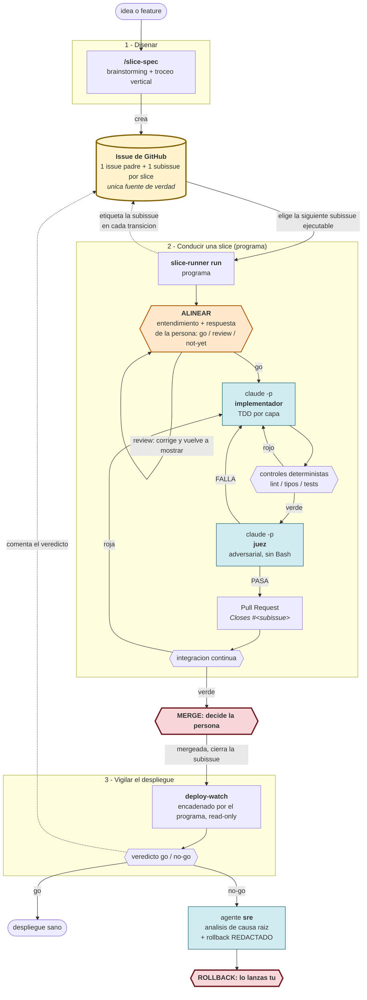

# agentic-skills

Skills personales de Claude Code que convierten **una idea en codigo en produccion vigilado**, sin
perder el control humano en los dos puntos donde importa: el merge y el rollback.

No es de la organizacion: de momento, uso personal.

## Para que existe

El problema no es que un agente no sepa escribir codigo: es que un agente suelto sobre una tarea
grande **degrada en silencio**. Pierde el hilo de las instrucciones a medida que crece la
conversacion, se auto-aprueba, se mide con la vara que mas le conviene, y produce trabajo que parece
terminado y no lo esta. Al final revisar lo que hizo cuesta mas que haberlo hecho.

Este repo es el intento de arreglar eso con **estructura en vez de confianza**:

- **Trabajo troceado en rebanadas verticales** (*slices*) pequenas y entregables, con **todo el estado
  en un issue de GitHub**: los subagentes que hacen el trabajo nacen y mueren en cada slice -ahi el
  contexto si es desechable-, y como no queda nada en la sesion, puedes tirarla y abrir otra entre
  slices en vez de compactar. En el flujo anterior, con la skill `/slice-runner`, lo que no se limpiaba
  solo era el contexto del **orquestador**, que vivia en tu sesion: eso lo decidias tu (ver "El
  contexto" mas abajo). En el flujo que conduce hoy una slice, el programa corre como proceso aparte y
  no acumula nada en tu sesion.
- **El que implementa no verifica.** Dos subagentes distintos, con instrucciones distintas, y el
  verificador es adversarial y no puede ejecutar nada (no tiene `Bash`): su unico trabajo es juzgar.
- **Lo mecanico lo deciden scripts, no el juicio de un agente.** Si es una regla exacta (¿esta verde
  la integracion continua? ¿el diff staged solo tiene los ficheros de la slice? ¿el veredicto del
  juez cumple su formato?), lo resuelve un script cuyo codigo de salida es autoritativo.
- **La vara de medir la declara el repo, no el agente.** Convenciones y comandos de control se
  escriben antes de empezar y se confirman con una persona; en tiempo de ejecucion solo se leen.
- **El estado vive fuera del contexto**, en un issue de GitHub que cualquiera puede leer.
- **Nada bloquea una shell.** Las esperas (integracion continua, merge, despliegue) son ticks en
  background.

Encaja con lo que se llama *loop engineering* (assess -> act -> verify -> stop) y con el escalon
"supervised autonomy" de los modelos de adopcion; el detalle y las fuentes estan en
`docs/design-notes.md` y `docs/maturity-map.md`.

## El flujo de un cambio



Lo que hay que leer del diagrama: **el issue padre y su subissue son el bus** entre el programa y quien
lo invoca (no se pasan ficheros ni memoria de sesion), los rombos son **decisiones deterministas** (los
controles, el veredicto del juez, el estado de la integracion continua), las cajas azules son **llamadas
sin estado al harness** (`claude -p`, no un subagente que viva en tu sesion), la naranja es la **pausa de
alineacion** -el programa espera tu `go`, un `review` con una correccion, o nada todavia- y las dos rojas
son los **unicos puntos donde para y decides tu**: mergear, y si el despliegue sale mal, el rollback.

Este es el flujo que conduce hoy `uv run slice-runner run` (detalle en "El paso que ya es un programa").
Tambien existe un flujo anterior, orquestado a mano por la skill `/slice-runner` con los subagentes
`agents/slice-implementer.md` y `agents/slice-verifier.md`: sigue instalable (ver "Instalacion"), pero ya
no es lo que conduce una slice, y difiere justo en lo que ve quien revisa la pull request -como
referencia el issue-: el flujo con la skill escribe `Part of #N` porque una feature es un solo issue con
todas sus slices dentro; el flujo del programa escribe `Closes #<subissue>` porque cada slice es su
propia subissue y GitHub la cierra sola al mergear.

## Las piezas

| Pieza | Que es | Para que |
|---|---|---|
| `skills/slice-spec/SKILL.md` | Skill de autoria | Convierte una idea en una spec bien formada y **crea el issue**. Envuelve `superpowers:brainstorming` para el diseno; el troceo lo lleva su propio cerebro (`skills/slice-spec/references/slicing.md`). Modo `validate` para auditar una spec existente. No escribe codigo. |
| `skills/slice-runner/SKILL.md` | Skill orquestadora (flujo anterior, ver "El paso que ya es un programa") | Ejecuta **una** slice de punta a punta: alinear, implementar, controlar, verificar, abrir PR, esperar integracion continua verde, y **parar**. No mergea. |
| `agents/slice-implementer.md` | Definicion de subagente | El implementador. Su metodologia -ciclo TDD, exencion de capa, integridad de tests preexistentes, refactor tras cada verde, instrumentar la senal- va en su *system prompt*, no relatada por el orquestador: no se puede parafrasear ni saltar un item, y no cuesta contexto de la sesion. Tiene `Bash` porque correr el ciclo y los controles es su cometido. |
| `agents/slice-verifier.md` | Definicion de subagente | El juez adversarial. Su rubrica va en el *system prompt* (verbatim en cada invocacion, no parafraseada) y sus herramientas son `Read, Grep, Glob, Skill`: **sin `Bash`**, asi que su incapacidad de ejecutar controles es estructural, no una promesa. |
| `skills/deploy-watch/SKILL.md` | Skill de post-merge | Vigila el despliegue en produccion, read-only. Orquesta por tick las skills de observabilidad que haya (Prometheus, Elasticsearch, logs de Google Cloud, Sentry...) segun el radio de impacto del cambio. Nunca ejecuta rollback: lo redacta. |
| `skills/slice-runner/scripts/controles.py` | Script determinista | Cinco subcomandos: `controles` (ejecutar los comandos declarados; el log va a disco), `pr-hygiene` (que el diff staged solo tenga los ficheros de la slice), `diff-bundle` (materializar el diff para el juez, que no puede calcularlo), `ci-status` (estado de la integracion continua en un tiro) y `verify-verdict` (validar la forma del veredicto y contar severidades). |
| `skills/slice-runner/scripts/issue_body.py` | Script determinista | Nucleo puro de parseo/reescritura del cuerpo del issue + interfaz de linea de comandos (`show`, `set-estado`). Fail-closed: si el issue viene vacio no escribe, porque un `edit` a ciegas borraria la spec entera. |
| `skills/slice-runner/scripts/discover_controles.py` / `discover_conventions.py` | Helpers de descubrimiento | Los usa `slice-spec` para **proponer** los controles y las fuentes de convencion del repo. Descubren y no deciden: confirma la persona. |
| `skills/slice-runner/scripts/metrics.py` | Registro durable | Telemetria del loop (veredicto, reintentos de controles / de verificacion / de integracion continua, descartes del juez) en `~/.claude/slice-runner/metrics.jsonl`, fuera del repo. Sirve para decidir cuando subir de nivel de autonomia. |
| `skills/deploy-watch/scripts/deploy_core.py` | Nucleo puro | La decision go/no-go: umbrales relativos a baseline, confirmacion sostenida, scorecard, veredicto. La toma el codigo, no la impresion del agente. |
| `skills/deploy-watch/references/monitoring.md`, `skills/slice-spec/references/slicing.md`, `skills/slice-spec/references/observabilidad.md` | Documentos de referencia | Conocimiento cargado bajo demanda: que senales mirar y como leerlas, como trocear, y como decidir la observabilidad de una slice. |
| `src/slice_runner/` | Programa orquestador | El trozo del pipeline que ya **no** es un agente: `run` conduce una slice de punta a punta; `verify`, que calcula el diff de la slice, se lo pasa **dentro del prompt** al juez -invocado como una llamada sin estado, `claude -p` con el esquema del veredicto- y emite el veredicto por salida estandar con su codigo de salida (tabla en "El paso que ya es un programa"); `explain` contesta que paso viene despues de un resultado y cuando se agota un presupuesto, sin montar un run; y `read` abre la conversacion grabada de una llamada concreta. Cada llamada al harness deja su rastro en `src/slice_runner/infrastructure/local_call_trace.py` y cada veredicto de `verify` en `src/slice_runner/infrastructure/local_corpus.py`, los dos escritos fuera del repo (ver "El paso que ya es un programa"). Capas separadas (`domain/`, `application/`, `infrastructure/`) y tests co-localizados. El *por que* de esta forma esta en `docs/superpowers/specs/2026-07-31-orquestador-como-programa-design.md`. |
| `docs/` | Memoria del proyecto | `conventions/` (la vara de cada capa, cargada a demanda: la tabla de enrutado esta en `CLAUDE.md`), `design-notes.md` (cada decision y su porque, para no re-derivarlo), `research-agent-loops.md` (research citado), `maturity-map.md` (donde encaja el pipeline), `12-factor.md` (auditoria contra los 12 factores + el spike que mide si `claude -p` sirve de agente sin estado), `docs/superpowers/specs/` (un design-doc por cambio). |
| `tests/` | Unit tests offline | La logica pura se cubre en **dos arboles**: aqui la de los scripts -cuerpo del issue, controles, metricas, nucleo del deploy- y los **contratos duplicados a proposito** entre skills; en `src/slice_runner/tests/`, co-localizada dentro del paquete, la de `src/slice_runner/`. |
| `smoke/` | Smoke test real | Lo que los unit tests no pueden cubrir: la entrada/salida real contra `gh` y la integracion continua de GitHub Actions, con una fixture autocontenida y las recetas para provocar cada camino de fallo. Ver `smoke/README.md`. |

### Como interactuan (el contrato entre piezas)

- **El issue es la unica interfaz entre skills y programa.** `slice-spec` lo escribe. En el flujo
  anterior, la skill `/slice-runner` lo lee, elige una slice y reescribe **solo su linea** en cada
  transicion; en el flujo que conduce hoy una slice, el programa etiqueta la subissue en cada
  transicion (ver el diagrama de "El flujo de un cambio"). `deploy-watch` comenta el veredicto en los
  dos flujos. No hay estado local, ni ledger, ni panel: nada que se desincronice o que haya que
  descartar.
- **El issue tambien declara la vara.** Sus secciones `## Fuentes de convencion` y `## Controles`
  (descubiertas por los helpers, **confirmadas por una persona**) son lo que fija con que se mide este
  repo. En tiempo de ejecucion ningun agente abre un `Makefile`: si esas secciones faltan,
  `slice-runner` para en vez de ejecutar con la vara vacia.
- **Nadie que juzgue ve output de build.** Los controles deterministas corren **antes** del juez, y su
  salida va a disco: el orquestador reenvia rutas sin leerlas. Un `ruff` sucio no debe gastar un
  reintento adversarial, y un traceback de pytest en el contexto del unico agente cuyo valor es el
  juicio es contaminarlo gratis.
- **El orden del tramo final no es cosmetico**: `git add` -> `pr-hygiene` -> controles ->
  `diff-bundle` -> verificador -> **commit**. Se stagea antes de medir -un control que lee el indice
  no ve un fichero nuevo sin stagear- y el commit va detras del veredicto, asi que un FALLA no deja
  rastro que deshacer y la slice sigue siendo un solo commit sin `--amend`.
- **La intencion viaja y no se resume.** El issue abre con `## Intencion` y cada slice lleva su linea
  `INTENCION:`; de ahi sale el cuerpo de la pull request, que cuenta **el por que** en vez de narrar el
  diff -eso ya lo cuenta GitHub mejor-. Vara: si borras la slice, ¿que queda roto o imposible?
- **La observabilidad es parte de la slice.** Cada slice que cambia comportamiento en produccion
  declara su linea `SENAL:` (como se comprueba viva), que es lo que `deploy-watch` consume despues; las
  exentas lo declaran con motivo.

## Como se arranca un ciclo

El primer paso es siempre el mismo, en los dos flujos: `/slice-spec` disena, trocea y crea el issue,
una vez por feature. Lo que cambia es como se conduce cada slice despues:

```
/slice-spec              # una vez por feature: disena, trocea y crea el issue

# despues, elige uno:
uv run slice-runner run 42 --repo <org>/<repo> --base master   # hoy: programa, una invocacion por slice
/slice-runner #42                                              # flujo anterior: skill, una sesion por slice
```

Lo que sigue en esta seccion -la sesion por slice, el aviso de compactar, `/loop`- describe el **flujo
anterior** con la skill `/slice-runner`, porque es el que necesita que decidas donde cortas la sesion.
El programa no vive en tu sesion (ver "El paso que ya es un programa" y "El contexto"), asi que nada de
esto le aplica: se lanza y para solo donde le toca.

Con la skill, lo que hay que decidir a mano no es ninguno de los dos comandos, es **donde cortas la
sesion**: una sesion por slice. `/slice-spec` en la suya, y cada `/slice-runner` en una nueva. No es
ceremonia -es que el orquestador vive en tu sesion y acumula el run entero (ver "El contexto")-, y es
seguro porque **todo el estado esta en el issue**: al arrancar re-lee el issue, ve que slices estan
mergeadas y coge la siguiente. Nada viaja en la conversacion.

```
sesion 1:  /slice-spec        -> issue #42 con la spec y las N slices
sesion 2:  /slice-runner #42  -> slice-01 -> PR -> CI verde -> [mergeas tu] -> deploy-watch
sesion 3:  /slice-runner #42  -> slice-02 -> ...
```

Si en una sesion te salta el aviso de compactar a mitad de slice, la respuesta no es compactar: es
dejar que la slice termine (o que pare donde este, que el issue lo registra), abrir sesion nueva e
invocar otra vez. Compactar deja al orquestador decidiendo con el contexto mutilado.

`/loop` sirve para no teclear el comando cada vez, no para higiene de contexto: reinyecta el prompt en
la **misma** conversacion. Usalo para una tanda corta de slices, no para una feature entera.

### El paso que ya es un programa

Conducir una slice ya no lo orquesta la skill: lo ejecuta un programa instalable, que se puede lanzar
solo. `run` conduce la siguiente slice ejecutable del issue de punta a punta -alinear, implementar,
controlar, verificar, abrir la pull request, esperar a la integracion continua- y para donde diga el
estado; el estado vive en la subissue, asi que una invocacion interrumpida se retoma reinvocando. Con
`--slice` se nombra la slice concreta a conducir en vez de dejar que el programa elija la siguiente,
lo que permite repartir el trabajo entre varios worktrees; pedir una que no existe en el issue o que no
es ejecutable falla en cerrado, sin tocar nada.

#### Comandos

| Subcomando | Para que sirve | Ejemplo |
|---|---|---|
| `run` | Conduce la siguiente slice ejecutable del issue de punta a punta -alinear, implementar, controlar, verificar, abrir la pull request, esperar la integracion continua- y para donde diga el estado. `--slice` nombra una slice concreta en vez de dejar que el programa elija. | `uv run slice-runner run 38 --repo alcaptar/agentic-skills --base master` |
| `verify` | Juzga lo que hay staged contra el branch-point de la base y emite el veredicto por salida estandar (o el motivo de no tenerlo, por salida de error). | `uv run slice-runner verify --repo . --base master --slice slice-01` |
| `explain` | Contesta que paso viene despues de un resultado, y cuando se agota un presupuesto, sin montar un run: es una funcion pura sobre el estado que le llega por entrada estandar. | `echo '{"run": {"step": "run-controls", "control_retries": 2}, "outcome": "failed"}' \| uv run slice-runner explain` |
| `read` | Abre la conversacion grabada de una llamada concreta del rastro y la emite legible por salida estandar, para que la lea una persona. | `uv run slice-runner read --repo . --slice slice-04 --step implement` |
| `spend` | Suma lo que gasto el harness en las llamadas que sirvieron un paso de una slice (coste, turnos, duracion, numero de llamadas) y lo emite como JSON. | `uv run slice-runner spend --slice slice-04 --step implement` |

```bash
uv run slice-runner run 38 --repo alcaptar/agentic-skills --base master
uv run slice-runner run 38 --repo alcaptar/agentic-skills --base master --slice slice-01
uv run slice-runner verify --repo . --base master --slice slice-01
```

Juzga **lo que hay staged** contra el branch-point de la base -que es lo que sera el commit-, emite el
veredicto como JSON por salida estandar y **cualquier motivo por el que no haya veredicto** por salida de
error, nunca mezclados. Ademas escribe: cada verificacion anexa una linea a
`~/.claude/slice-runner/corpus/verdicts.jsonl` -o al equivalente bajo `CLAUDE_CONFIG_DIR`- con el
identificador de la slice, el diff juzgado, el veredicto entero y su conteo por severidad. Es un registro
append-only, y vive **fuera del repo** para que ningun `git add` de la slice se lo lleve a la pull request.

Y **cada llamada al harness** -la que entiende, la que implementa y la que juzga- anexa su linea a
`~/.claude/slice-runner/trace/calls.jsonl`, con la slice, el paso que servia y el identificador de sesion de
su conversacion. Es lo que permite abrir la conversacion de una llamada concreta -viven en
`~/.claude/projects/`, una por sesion- sin adivinar por marcas de tiempo entre decenas de ficheros. Tambien
append-only y tambien fuera del repo, y por el mismo motivo.

`read` es quien la abre:

```bash
uv run slice-runner read --repo . --slice slice-04 --step implement
```

Parte de ese rastro -nunca de una busqueda por marca de tiempo- para encontrar la sesion, y de ahi lee
directamente la conversacion grabada por Claude Code: cuantos turnos tuvo, que herramienta uso cada uno,
que leyo de vuelta y que decidio en texto, con el gasto en tokens de la conversacion entera. Lo emite como
texto legible por salida estandar, no JSON -es para que lo lea una persona, no otro programa-. Sin una
llamada de ese paso en el rastro, o sin la conversacion todavia en disco, sale por `4`: no hay nada que
abrir con lo que se le paso.

El codigo de salida es el contrato con quien lo invoca:

| | Que significa |
|---|---|
| `0` | El comando contesto lo que se le pidio: en `verify`, PASA sin ningun hallazgo de severidad alta; en `run`, la slice cerro mergeada |
| `1` | FALLA: el juez veta la slice |
| `2` | No hay veredicto de fiar: un proceso del run no se pudo lanzar, o el juez devolvio un veredicto incoherente |
| `3` | No hay nada que juzgar: el indice esta vacio (¿falto el `git add`?) |
| `4` | Error de uso: el repo o la base no resuelven, falta un argumento, el issue o el estado que se quiere leer no se pueden leer, o `read` no encuentra la conversacion pedida |
| `5` | `run`: la slice cerro **sin** mergear (controles, juez, integracion continua o presupuesto). Hay que mirar el issue; reinvocar sin tocar nada repite el cierre |
| `6` | `run`: la slice espera a una persona (pausa de alineacion). Reinvocar no sirve hasta que alguien conteste |
| `7` | `run`: se agoto la espera con el run todavia abierto. Reinvocar es exactamente lo que toca, salvo esperando el merge: ahi la pull request nace en borrador (`--draft`) y reinvocar no la saca de ahi -hay que sacarla a mano-, y tanto la salida como un comentario en la subissue lo dicen |
| `8` | `run`: los prechecks pararon la invocacion antes de tocar codigo |
| `9` | `run`: el issue no tiene ninguna slice ejecutable (todas cerradas, bloqueadas o abortadas) |
| `10` | `run`: el run se interrumpio antes de llegar a una parada -`gh` o `git` fallaron, el foro contesto algo ilegible, el registro durable no se pudo escribir-. El estado persistido sigue siendo bueno |
| `11` | `run`: la pull request de la slice se cerro **sin** mergear, asi que el merge que la invocacion esperaba ya no puede llegar. El run se queda abierto en su paso; lo decide una persona (reabrir la pull request, o cerrar la slice) |
| `12` | Una llamada a un proceso externo agoto su tope por llamada y se mato, asi que no hay respuesta que interpretar. Reinvocar a ciegas vuelve a pagar el tope entero: primero hay que mirar **que** se colgo |

`1` es un veredicto y `2` no lo es: esa es la distincion que hace el codigo de salida y que un booleano
perderia. Del `5` en adelante la pregunta es otra -¿que hace quien invoca ahora?-, y por eso hay un codigo
por decision y no uno por excepcion: `7` y `10` se reinvocan, `5`, `6`, `9` y `12` no. El `7` esperando
el merge es la excepcion dentro del propio codigo: la pull request nace en borrador, asi que reinvocar
sin sacarla de ahi repite la misma espera.

### La secuencia y los presupuestos, interrogables sin montar un run

Que viene despues de cada paso, y cuando se agota un presupuesto, tampoco lo decide un modelo leyendo
prosa: es una funcion pura del dominio (`StateMachine`). Se le puede preguntar de una en una, con el
estado del run por entrada estandar:

```bash
echo '{"run": {"step": "run-controls", "control_retries": 2}, "outcome": "failed"}' \
  | uv run slice-runner explain
```

```json
{"run": {"step": "run-controls", "control_retries": 2, "verify_retries": 0, "ci_retries": 0,
 "indeterminate_ticks": 0, "verify_discards": 0}, "state": "blocked-controls", "wait_seconds": 0}
```

La respuesta trae **el run entero** (con los contadores ya gastados), el estado en el que queda -`open`
mientras siga vivo, y si no, el cierre concreto- y **cuantos segundos hay que esperar** antes del
proximo tick, para que el numero de la ventana de gracia no lo decida quien tickea. Los presupuestos son
dos reintentos de controles, dos de verificacion, uno de integracion continua roja, y 3 ticks
indeterminados consecutivos con 30 s o mas entre tick y tick. Por encima de todos ellos hay dos topes que
no cuentan intentos sino gasto: **25 $ de harness por slice**, que cierra el run como abortado y es el
backstop del unico bucle sin cierre propio -el descarte de un veredicto incoherente, que no gasta reintento
porque no se toco el codigo-, y **30 minutos de espera**, que terminan la invocacion dejando el run abierto
donde estaba. El motivo de los dos numeros esta en `docs/conventions/domain.md`. Un par (paso, resultado)
que la secuencia no describe **no cae en una rama generica**: sale por `4`.

## Ejemplo: una feature de punta a punta

Este ejemplo narra el flujo mas antiguo, con la skill `/slice-runner` orquestando los subagentes a mano
en tu propia sesion (sigue instalable, ver "Instalacion"). Hoy una slice la conduce el programa
(`uv run slice-runner run`, seccion anterior); la diferencia que se nota desde fuera es la pull request,
que ahi lleva `Closes #<subissue>` en vez del `Part of #42` que usa este ejemplo.

Supongamos que hoy se pueden crear pedidos con cantidad negativa y el stock queda en negativo sin que
nadie se entere.

**1. Disenar y crear el issue** (sesion nueva)

```
/slice-spec

> Quiero validar la cantidad de las lineas de pedido: hoy se aceptan negativas
> y el stock se corrompe en silencio.
```

La skill hace brainstorming del diseno, propone el troceo vertical, descubre los controles y las
convenciones del repo (y **te los pregunta** para confirmarlos), y crea el issue. Sale algo asi
-mismo formato que la fixture del smoke, `smoke/fixture/spec.md`-:

```markdown
## Intencion

Hoy se pueden crear lineas de pedido con cantidad negativa: el stock queda en negativo
y nadie se entera hasta el recuento fisico.

## Fuentes de convencion
- doc: CONVENTIONS.md
- skill: backend-best-practices

## Controles
- lint: make linting
- types: make check-types
- tests: make test

## Slices

- [ ] slice-01 (cantidad-value-object): Value object `Cantidad` que rechaza <= 0 [pendiente]
      INTENCION: sin el, la regla vive repartida y cada llamador la olvida a su manera
      ACEPTACION: Cantidad(0) y Cantidad(-1) lanzan ValueError; Cantidad(1) es valida.
      SENAL: exenta - value object interno sin efecto observable en produccion
- [ ] slice-02 (rechazar-cantidad-negativa): El endpoint devuelve 422 [pendiente]
      INTENCION: hoy la API acepta la cantidad negativa y corrompe el stock
      ACEPTACION: POST /pedidos con cantidad -1 devuelve 422 y no crea el pedido.
      SENAL: contador orders_rejected_total{reason="invalid_quantity"}
```

**2. Ejecutar la primera slice** (sesion nueva)

```
/slice-runner #42
```

Y hace, sin intervencion: lee el issue -> marca `slice-01` como `[en-curso]` -> **te muestra su
entendimiento y espera tu go/no-go** -> implementa con TDD -> deja los controles verdes -> lanza el
verificador adversarial -> commit -> abre la pull request `feat(cantidad-value-object): ...` con
`Part of #42` -> tickea en background hasta integracion continua verde -> marca la slice
`[esperando-merge] PR #43` y **para**.

La linea del issue va contando la historia sola:

```
- [ ] slice-01 (cantidad-value-object): ... [esperando-merge] PR #43
```

Si algo se rompe, la linea lo dice y el loop para en vez de seguir: `bloqueada: controles`,
`bloqueada: verify`, `bloqueada: ci-roja`, `bloqueada: ci-indeterminada` o `bloqueada:
sin-subagentes`.

**3. Mergear (tu)**

Revisas la pull request en GitHub y le das a merge. Eso es tuyo, no del pipeline.

**4. El despliegue se vigila solo**

`slice-runner` detecta el merge, marca la slice `[x] ... [mergeada]` y **encadena `deploy-watch`**,
que arranca sin preguntar nada que pueda inferir: captura baseline, tickea las senales relevantes al
radio de impacto del cambio, y comenta su veredicto en el issue #42. Si sale degradado, lanza el
agente `sre` para el analisis de causa raiz y **te redacta el rollback** para que lo lances tu.

**5. Siguiente slice** (sesion nueva)

```
/slice-runner #42
```

`slice-02`, misma vara. La sesion anterior ya lleva encima el run entero y no hace falta para nada: el
issue tiene el estado, asi que abrir otra no cuesta nada.

## El contexto

Esta seccion describe el **flujo anterior**, con la skill `/slice-runner` orquestando a mano en tu
sesion. En el flujo que conduce hoy una slice, el programa (`uv run slice-runner run`) ya corre fuera
de la sesion -es un proceso aparte, no una skill que viva en tu conversacion-, asi que nada de lo que
sigue le aplica.

De las tres skills, la unica que vive en tu sesion es el **orquestador** de `slice-runner`: lee el
issue, lanza los subagentes, corre los controles y espera la CI. Todo lo caro esta deliberadamente
**fuera** de el -el output de build va a disco y solo se reenvian rutas; las convenciones, el diff y el
codigo los leen los subagentes en su propio contexto-, pero el orquestador acumula igual, y con varias
slices por feature acaba tocando compactar.

La asimetria, dicha entera: **el contexto desechable es el de los subagentes**, que nacen y mueren en
cada slice; el de tu sesion no se limpia solo, y cada slice paga otra vez el `SKILL.md` del runner y
los mensajes finales de sus agentes. De ahi la regla de la seccion anterior -una sesion por slice- y de
ahi que compactar a mitad de run sea el caso a evitar y no un inconveniente.

Lo que se ha hecho para que quepa mas en cada sesion (2026-07-31): el relato largo salio del `SKILL.md`
a `skills/slice-runner/references/por-que.md`, que solo se carga para cambiar la skill, y la
metodologia del implementador se fue a su propio agente en vez de redactarla el orquestador en cada
invocacion. Unas 5.000 palabras menos de contexto por slice.

Sacar al orquestador de la sesion por completo -lo que en su momento quedo pendiente dentro de la skill,
al final de `docs/design-notes.md`- no se resolvio recortando mas la skill: se resolvio
reemplazandola. El programa (`uv run slice-runner run`, ver "El paso que ya es un programa") es esa
salida, hecha como proceso aparte en vez de como skill mas ligera; conducir una slice hoy ya no depende
de que abras sesion nueva. Lo que sigue vivo de esta seccion es la parte historica: por que la skill,
mientras fue el flujo que conducia una slice, nunca dejo de vivir en tu sesion.

## Instalacion

**Este repo es la fuente de verdad.** Las skills y el agente viven aqui; `~/.claude/skills/` y
`~/.claude/agents/` apuntan por symlink, asi que se editan versionados y siguen activos en Claude
Code. Ambos directorios son **de usuario**, no de proyecto: valen en cualquier repo donde invoques
`slice-runner`.

Esto hace falta para las skills -`/slice-spec` (disena y crea el issue en los dos flujos) y el flujo mas
antiguo con `/slice-runner` y sus agentes-. Conducir una slice con el programa (`uv run slice-runner
run`, ver "El paso que ya es un programa") no instala nada por symlink: basta con estar en este repo.

```bash
ln -s "$PWD/skills/slice-spec" ~/.claude/skills/slice-spec
ln -s "$PWD/skills/slice-runner" ~/.claude/skills/slice-runner
ln -s "$PWD/skills/deploy-watch" ~/.claude/skills/deploy-watch
ln -s "$PWD/agents/slice-implementer.md" ~/.claude/agents/slice-implementer.md
ln -s "$PWD/agents/slice-verifier.md" ~/.claude/agents/slice-verifier.md
```

Los de los agentes **no son opcionales**: sin ellos, `subagent_type: slice-implementer` o
`slice-verifier` no resuelven y `slice-runner` para en el paso 3 con `bloqueada: sin-subagentes`.

> **Gotcha verificado (2026-07-27): las skills se releen, los agentes no.** Editar un `SKILL.md`
> cambia el comportamiento en la sesion en curso; editar una definicion de `agents/` **no**. El
> registro de agentes se cachea al primer load, asi que la sesion sigue usando la definicion vieja:
> se comprobo lanzando el verificador tras reescribirlo y viendo que citaba campos de su system prompt
> anterior y usaba una herramienta que la version nueva ya no declara. **Tras tocar un agente hay que
> abrir sesion nueva antes de probarlo**, o el smoke valida la version equivocada sin avisar.

Otra consecuencia del symlink: **la rama en la que estas decide que codigo corre**. Si sondeas un
cambio de los scripts desde una rama creada en `origin/master`, corres los de `origin` y nada avisa.

## Principios comunes

- Escritor != verificador, pero el verificador **revisa convenciones y arquitectura, no re-testea**
  (la integracion continua y los criterios de aceptacion gobiernan la correccion) y **no ejecuta
  controles ni ve output de build**: su presupuesto entero es para lo semantico.
- **Los subagentes son la garantia, no un detalle**: invocar una skill cuenta como pedirlos. Si el
  entorno los veta, decide **un solo criterio**: ¿se puede declarar la degradacion en el artefacto?
  Si si, degrada y declaralo ahi; si el artefacto entero significa la garantia perdida, para. De ahi
  salen las dos respuestas -`slice-runner` **para** (su pull request con PASA seria falsa de forma
  invisible) y `deploy-watch` **degrada declarandolo** (su veredicto puede decir como se obtuvo, y lo
  calcula `deploy_core.py`)-, que por eso no son dos reglas sino una. El criterio se escribe **en cada
  skill**, no en un fichero compartido: se duplica a cambio de que todo quede versionado aqui y cada
  skill sea autocontenida.
- Controles de parada objetivos y deterministas.
- Convenciones del repo como vara de medir principal.
- Estado del run en el **issue de GitHub**; el registro duradero son el issue y las pull requests
  mergeadas, no ficheros de estado.
- La pull request solo lleva el codigo de la slice (conventional commits, `name` como scope): `Part of
  #N` en el flujo con la skill `/slice-runner`, `Closes #<subissue>` en el flujo que conduce el
  programa.
- Control humano en los puntos de riesgo: merge y rollback.

## Desarrollo

```bash
make check   # ruff + mypy strict + pytest; todo verde antes de dar nada por terminado
```

Cubre tambien los `.md`, no solo el codigo: `tests/test_skill_contracts.py` compara los contratos que
estan escritos dos veces a proposito (motivos de bloqueo, veredictos, el JSON del verificador, el
criterio de degradacion) extrayendo el vocabulario de ambos lados, y comprueba que **toda ruta de
este repo citada en los `.md` existe**. Si editas una skill y eso se pone rojo, has movido una mitad
del contrato.

El toolchain lo gestiona `uv`, asi que no hay que instalar nada a mano; lanzalo siempre por ahi,
porque el programa de `src/` depende de `pydantic` y los scripts de `skills/` son stdlib puro. Las
convenciones estan en `docs/conventions/`, una por capa, y `CLAUDE.md` trae la tabla que dice cual leer
segun lo que vayas a tocar -mas el ritual antes de tocar una skill-. El detalle de cada decision, en
`docs/design-notes.md`.
