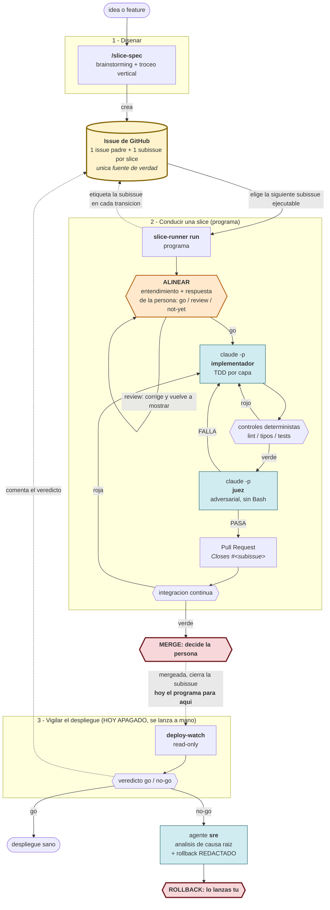

# agentic-skills

Skills personales de Claude Code que convierten **una idea en codigo en produccion vigilado**, sin
perder el control humano en los dos puntos donde importa: el merge y el rollback.

No es de la organizacion: de momento, uso personal.

**¿Vienes a usarlo?** `docs/arranque.md` dice que teclear, que cuesta y que hace en tu repo sin
preguntar. Esto de aqui abajo es el **por que**.

## Para que existe

El problema no es que un agente no sepa escribir codigo: es que un agente suelto sobre una tarea
grande **degrada en silencio**. Pierde el hilo de las instrucciones a medida que crece la
conversacion, se auto-aprueba, se mide con la vara que mas le conviene, y produce trabajo que parece
terminado y no lo esta. Al final revisar lo que hizo cuesta mas que haberlo hecho.

Este repo es el intento de arreglar eso con **estructura en vez de confianza**:

- **Trabajo troceado en rebanadas verticales** (*slices*) pequenas y entregables, con **todo el estado
  en un issue de GitHub**: los subagentes que hacen el trabajo nacen y mueren en cada slice -ahi el
  contexto si es desechable-, y como no queda nada en la sesion, puedes tirarla y abrir otra entre
  slices en vez de compactar. En el flujo anterior, con la skill `/slice-runner`, lo que no se limpiaba
  solo era el contexto del **orquestador**, que vivia en tu sesion: eso lo decidias tu (ver "El
  contexto" mas abajo). En el flujo que conduce hoy una slice, el programa corre como proceso aparte y
  no acumula nada en tu sesion.
- **El que implementa no verifica.** Dos subagentes distintos, con instrucciones distintas, y el
  verificador es adversarial y no puede ejecutar nada (no tiene `Bash`): su unico trabajo es juzgar.
- **Lo mecanico lo deciden scripts, no el juicio de un agente.** Si es una regla exacta (¿esta verde
  la integracion continua? ¿el diff staged solo tiene los ficheros de la slice? ¿el veredicto del
  juez cumple su formato?), lo resuelve un script cuyo codigo de salida es autoritativo.
- **La vara de medir la declara el repo, no el agente.** Convenciones y comandos de control se
  escriben antes de empezar y se confirman con una persona; en tiempo de ejecucion solo se leen.
- **El estado vive fuera del contexto**, en un issue de GitHub que cualquiera puede leer.
- **Nada bloquea una shell.** Las esperas (integracion continua, merge, despliegue) son ticks en
  background.

Encaja con lo que se llama *loop engineering* (assess -> act -> verify -> stop) y con el escalon
"supervised autonomy" de los modelos de adopcion; el detalle y las fuentes estan en
`docs/design-notes.md` y `docs/maturity-map.md`.

## El flujo de un cambio



Lo que hay que leer del diagrama: **el issue padre y su subissue son el bus** entre el programa y quien
lo invoca (no se pasan ficheros ni memoria de sesion), los rombos son **decisiones deterministas** (los
controles, el veredicto del juez, el estado de la integracion continua), las cajas azules son **llamadas
sin estado al harness** (`claude -p`, no un subagente que viva en tu sesion), la naranja es la **pausa de
alineacion** -el programa espera tu `go`, un `review` con una correccion, o nada todavia- y las dos rojas
son los **unicos puntos donde para y decides tu**: mergear, y si el despliegue sale mal, el rollback.

Este es el flujo que conduce hoy `uv run slice-runner run` (detalle en "El paso que ya es un programa"),
siempre contra el formato **padre mas una subissue por slice** que crea `slice-spec`. Hubo un flujo
anterior, orquestado a mano por la skill `/slice-runner` con dos subagentes definidos -slice-implementer
y slice-verifier-, sobre un formato mas viejo -un solo issue con un checklist de slices dentro,
donde la pull request referenciaba con `Part of #N`-: ese flujo ya no vive en este repo. La skill que lo
conducia esta congelada en `alcaptar/agentic-skills-legacy` (ver "Instalacion" para donde apunta el
symlink hoy), y los dos agentes se retiraron de aqui con ella: el programa nunca los uso, y tiene su
propia metodologia y su propia rubrica (ver `docs/conventions/infrastructure.md`). El programa, en
cambio, siempre escribe `Closes #<subissue>` porque cada slice es su propia subissue y GitHub la cierra
sola al mergear.

## Las piezas

| Pieza | Que es | Para que |
|---|---|---|
| `skills/slice-spec/SKILL.md` | Skill de autoria | Convierte una idea en una spec bien formada y **crea el issue padre mas una subissue por slice**. Envuelve `superpowers:brainstorming` para el diseno; el troceo lo lleva su propio cerebro (`skills/slice-spec/references/slicing.md`), que saca delante el **contrato de toda frontera** porque es lo que deja construir productor y consumidor a la vez. Cierra proponiendo **que slices pueden correr en paralelo** y, confirmado, monta un worktree por slice y lanza sus runs. Modo `validate` para auditar una spec existente. No escribe codigo. |
| `skills/deploy-watch/SKILL.md` | Skill de post-merge | Vigila el despliegue en produccion, read-only. Orquesta por tick las skills de observabilidad que haya (Prometheus, Elasticsearch, logs de Google Cloud, Sentry...) segun el radio de impacto del cambio. Nunca ejecuta rollback: lo redacta. |
| `skills/slice-runner/scripts/discover_controles.py` / `discover_conventions.py` | Helpers de descubrimiento | Los usa `slice-spec` para **proponer** los controles y las fuentes de convencion del repo. Descubren y no deciden: confirma la persona. |
| `skills/slice-runner/scripts/metrics.py` | Reporte de la telemetria | Agrega `~/.claude/slice-runner/log/metrics.jsonl` (veredicto, reintentos de controles / de verificacion / de integracion continua, descartes del juez) para decidir cuando subir de nivel de autonomia. El programa escribe esa fila el mismo, sin lanzar este script (`src/slice_runner/infrastructure/local_metrics_log.py`); este script solo la agrega. |
| `skills/deploy-watch/scripts/deploy_core.py` | Nucleo puro | La decision go/no-go: umbrales relativos a baseline, confirmacion sostenida, scorecard, veredicto. La toma el codigo, no la impresion del agente. |
| `skills/deploy-watch/references/monitoring.md`, `skills/slice-spec/references/slicing.md`, `skills/slice-spec/references/observabilidad.md` | Documentos de referencia | Conocimiento cargado bajo demanda: que senales mirar y como leerlas, como trocear, y como decidir la observabilidad de una slice. |
| `src/slice_runner/` | Programa orquestador | El trozo del pipeline que ya **no** es un agente: `run` conduce una slice de punta a punta; `verify`, que calcula el diff de la slice, se lo pasa **dentro del prompt** al juez -invocado como una llamada sin estado, `claude -p` con el esquema del veredicto- y emite el veredicto por salida estandar con su codigo de salida (tabla en "El paso que ya es un programa"); `explain` contesta que paso viene despues de un resultado y cuando se agota un presupuesto, sin montar un run; y `read` abre la conversacion grabada de una llamada concreta. Cada llamada al harness deja su rastro en `src/slice_runner/infrastructure/local_call_trace.py` y cada veredicto de `verify` en `src/slice_runner/infrastructure/local_corpus.py`, los dos escritos fuera del repo (ver "El paso que ya es un programa"). Capas separadas (`domain/`, `application/`, `infrastructure/`) y tests co-localizados. El *por que* de esta forma esta en `docs/design-notes.md`. |
| `docs/` | Memoria del proyecto | `conventions/` (la vara de cada capa, cargada a demanda: la tabla de enrutado esta en `CLAUDE.md`), `design-notes.md` (cada decision y su porque, para no re-derivarlo), `research-agent-loops.md` (research citado), `maturity-map.md` (donde encaja el pipeline) y `12-factor.md` (auditoria contra los 12 factores + el spike que mide si `claude -p` sirve de agente sin estado). |
| `tests/` | Unit tests offline | La logica pura se cubre en **dos arboles**: aqui la de los scripts -cuerpo del issue, controles, metricas, nucleo del deploy- y los **contratos duplicados a proposito** entre skills; en `src/slice_runner/tests/`, co-localizada dentro del paquete, la de `src/slice_runner/`. |
| `smoke/` | Smoke test real | Lo que los unit tests no pueden cubrir: la entrada/salida real contra `gh` y la integracion continua de GitHub Actions, con una fixture autocontenida y las recetas para provocar cada camino de fallo. Ver `smoke/README.md`. |

### Como interactuan (el contrato entre piezas)

- **El issue es la unica interfaz entre skills y programa.** `slice-spec` lo escribe. En el flujo
  anterior, la skill `/slice-runner` lo lee, elige una slice y reescribe **solo su linea** en cada
  transicion; en el flujo que conduce hoy una slice, el programa etiqueta la subissue en cada
  transicion (ver el diagrama de "El flujo de un cambio"). `deploy-watch` comenta el veredicto en los
  dos flujos. No hay estado local, ni ledger, ni panel: nada que se desincronice o que haya que
  descartar.
- **El issue tambien declara la vara.** Sus secciones `## Fuentes de convencion` y `## Controles`
  (descubiertas por los helpers, **confirmadas por una persona**) son lo que fija con que se mide este
  repo. En tiempo de ejecucion ningun agente abre un `Makefile`: si esas secciones faltan,
  `slice-runner` para en vez de ejecutar con la vara vacia.
- **Nadie que juzgue ve output de build.** Los controles deterministas corren **antes** del juez, y su
  salida va a disco: el orquestador reenvia rutas sin leerlas. Un `ruff` sucio no debe gastar un
  reintento adversarial, y un traceback de pytest en el contexto del unico agente cuyo valor es el
  juicio es contaminarlo gratis.
- **El orden del tramo final no es cosmetico**: `git add` -> `pr-hygiene` -> controles ->
  `diff-bundle` -> verificador -> **commit**. Se stagea antes de medir -un control que lee el indice
  no ve un fichero nuevo sin stagear- y el commit va detras del veredicto, asi que un FALLA no deja
  rastro que deshacer y la slice sigue siendo un solo commit sin `--amend`.
- **La intencion viaja y no se resume.** El issue abre con `## Intencion` y cada slice lleva su linea
  `INTENCION:`; de ahi sale el cuerpo de la pull request, que cuenta **el por que** en vez de narrar el
  diff -eso ya lo cuenta GitHub mejor-. Vara: si borras la slice, ¿que queda roto o imposible?
- **La observabilidad es parte de la slice.** Cada slice que cambia comportamiento en produccion
  declara su linea `SENAL:` (como se comprueba viva), que es lo que `deploy-watch` consume despues; las
  exentas lo declaran con motivo. El encadenado automatico esta **apagado hoy** (ver el paso 4 de "El
  flujo de un cambio"); la senal se sigue disenando y exigiendo igual.

## Como se arranca un ciclo

El primer paso es siempre el mismo: `/slice-spec` disena, trocea y crea el issue padre mas una subissue
por slice, una vez por feature. Lo que conduce cada slice despues es el programa:

```
/slice-spec                                                     # una vez por feature: disena, trocea y crea el issue padre + subissues
uv run slice-runner run 42 --repo <org>/<repo> --base master    # una invocacion por slice
```

El programa no vive en tu sesion (ver "El paso que ya es un programa" y "El contexto"): se lanza y para
solo donde le toca, asi que no hay que decidir donde cortar una sesion ni vigilar el aviso de compactar.

Hubo un flujo anterior donde si importaba: la skill `/slice-runner`, orquestando a mano en tu sesion,
sobre un formato de issue mas viejo (un solo issue con checklist). Ese flujo esta retirado de este repo y
congelado en `alcaptar/agentic-skills-legacy` -incluido `/loop`, que solo tenia sentido reinyectando el
prompt de esa skill en la misma conversacion-. Se documenta por si alguien lo sigue necesitando; no es
lo que arranca un ciclo hoy.

### El paso que ya es un programa

Conducir una slice ya no lo orquesta la skill: lo ejecuta un programa instalable, que se puede lanzar
solo. `run` conduce la siguiente slice ejecutable del issue de punta a punta -alinear, implementar,
controlar, verificar, abrir la pull request, esperar a la integracion continua- y para donde diga el
estado; el estado vive en la subissue, asi que una invocacion interrumpida se retoma reinvocando. Con
`--slice` se nombra la slice concreta a conducir en vez de dejar que el programa elija la siguiente,
lo que permite repartir el trabajo entre varios worktrees; pedir una que no existe en el issue o que no
es ejecutable falla en cerrado, sin tocar nada.

#### Comandos

| Subcomando | Para que sirve | Ejemplo |
|---|---|---|
| `run` | Conduce la siguiente slice ejecutable del issue de punta a punta -alinear, implementar, controlar, verificar, abrir la pull request, esperar la integracion continua- y para donde diga el estado. `--slice` nombra una slice concreta en vez de dejar que el programa elija. | `uv run slice-runner run 38 --repo alcaptar/agentic-skills --base master` |
| `verify` | Juzga lo que hay staged contra el branch-point de la base y emite el veredicto por salida estandar (o el motivo de no tenerlo, por salida de error). | `uv run slice-runner verify --repo . --base master --slice slice-01` |
| `explain` | Contesta que paso viene despues de un resultado, y cuando se agota un presupuesto, sin montar un run: es una funcion pura sobre el estado que le llega por entrada estandar. | `echo '{"run": {"step": "run-controls", "control_retries": 2}, "outcome": "failed"}' \| uv run slice-runner explain` |
| `read` | Abre la conversacion grabada de una llamada concreta del rastro y la emite legible por salida estandar, para que la lea una persona. `--repo` e `--issue` identifican el run -son los mismos que fija `run`-, y `--worktree` es la ruta donde corrio la llamada. | `uv run slice-runner read --repo alcaptar/agentic-skills --issue 38 --worktree . --slice slice-04 --step implement` |
| `spend` | Suma lo que gasto el harness en las llamadas que sirvieron un paso de una slice (coste, turnos, duracion, numero de llamadas) y lo emite como JSON. `--repo` e `--issue` identifican el run, igual que en `read`. | `uv run slice-runner spend --repo alcaptar/agentic-skills --issue 38 --slice slice-04 --step implement` |
| `doctor` | Comprueba si el entorno esta listo para conducir una slice -`git`, `gh` autenticado, `claude` y las skills `slice-spec`/`deploy-watch` instaladas- y lo emite legible por salida estandar, un chequeo por linea con el comando que lo arregla cuando falta. No arregla nada el mismo. `--repo` comprueba ademas que ese repo se puede leer, y `--worktree` junto con `--base` compara la base local contra su remoto y avisa si esta por detras -un aviso no cambia el codigo de salida-. Los tres son opcionales. | `uv run slice-runner doctor --repo alcaptar/agentic-skills --worktree . --base master` |
| `metrics` | Relee `metrics.jsonl`, `calls.jsonl` y `spend.jsonl` -sin escribir ningun estado nuevo- y emite una linea de JSON por slice cerrada dentro de la ventana pedida, ya con su identidad, su configuracion, su tamano, su gasto y su resultado unidos. `--repo` acota a un repo (por defecto todos) y `--since`/`--until` acotan por fecha (`YYYY-MM-DD`, por defecto desde el principio hasta ahora). `--out` -obligatorio- es la ruta donde se escribe una vista HTML autocontenida (coste frente a tamano, gasto por papel, vueltas en el tiempo), generada de esos mismos datos y que declara lo que no puede decir. | `uv run slice-runner metrics --repo alcaptar/agentic-skills --since 2026-01-01 --out /tmp/metrics.html` |
| `reset` | Borra el estado de ejecucion persistido de una subissue y deja su etiqueta en `estado:pendiente`, sin tocar la intencion, los criterios ni la senal de la spec. Deja un comentario diciendo cuando se reseteo y que la rama y el arbol de trabajo no se han tocado -esa limpieza la decide una persona-. Si la subissue no trae spec reconocible, o su cuerpo no se puede leer, no escribe nada. | `uv run slice-runner reset 38 --repo alcaptar/agentic-skills` |

```bash
uv run slice-runner run 38 --repo alcaptar/agentic-skills --base master
uv run slice-runner run 38 --repo alcaptar/agentic-skills --base master --slice slice-01
uv run slice-runner verify --repo . --base master --slice slice-01
```

Juzga **lo que hay staged** contra el branch-point de la base -que es lo que sera el commit-, emite el
veredicto como JSON por salida estandar y **cualquier motivo por el que no haya veredicto** por salida de
error, nunca mezclados. Ademas escribe: cada verificacion anexa una linea a
`~/.claude/slice-runner/log/verdicts.jsonl` -o al equivalente bajo `CLAUDE_CONFIG_DIR`- con el repo y el
issue del run, el identificador de la slice, el veredicto entero, su conteo por severidad y cuando se
escribio; el diff juzgado se anexa aparte, a `~/.claude/slice-runner/log/diffs.jsonl`, unido a su fila por
el mismo identificador de slice y la misma marca de tiempo -es lo que pesa, y separarlo es lo que deja
contar hallazgos sin cargarlo-. Los dos son un registro append-only, y viven **fuera del repo** para que
ningun `git add` de la slice se los lleve a la pull request. Un `verify` suelto -invocado sin que `run`
este conduciendo ningun issue- escribe esas filas con el repo vacio y el issue a `0`: no hay identidad real
que registrar fuera de un run conducido.

Y **cada llamada al harness** -la que entiende, la que implementa y la que juzga- anexa su linea a
`~/.claude/slice-runner/log/calls.jsonl`, con el repo y el issue del run, la slice, el paso que servia, el
identificador de sesion de su conversacion y cuando se escribio. El repo y el issue son los que distinguen
dos features que comparten el mismo identificador de slice -`slice-01` no es unico entre issues-, asi que
una fila nunca se puede confundir con la de otro run. Es lo que permite abrir la conversacion de una llamada
concreta -viven en `~/.claude/projects/`, una por sesion- sin adivinar por marcas de tiempo entre decenas de
ficheros. Tambien append-only y tambien fuera del repo, y por el mismo motivo.

Los cuatro almacenes durables del programa -`metrics.jsonl`, `calls.jsonl`, `spend.jsonl` y el par
`verdicts.jsonl`/`diffs.jsonl`- viven bajo el mismo directorio y el mismo patron de nombre,
`~/.claude/slice-runner/log/<concepto>.jsonl`: es el sitio a mirar para leer cualquiera de ellos junto, sin
recordar que unos colgaban de la raiz y otros de `trace/` o `corpus/`. Cada uno declara su esquema con un
`json_schema()` propio (`HarnessCallPayload`, `CallSpendPayload`, `MetricsEntryPayload`,
`CorpusVerdictPayload`, `CorpusDiffPayload`), asi que que campos trae una fila se puede preguntar a un
programa en vez de abrir el fichero.

`read` es quien la abre:

```bash
uv run slice-runner read --repo alcaptar/agentic-skills --issue 38 --worktree . --slice slice-04 --step implement
```

Parte de ese rastro -nunca de una busqueda por marca de tiempo- para encontrar la sesion, y de ahi lee
directamente la conversacion grabada por Claude Code: cuantos turnos tuvo, que herramienta uso cada uno,
que leyo de vuelta y que decidio en texto, con el gasto en tokens de la conversacion entera. Lo emite como
texto legible por salida estandar, no JSON -es para que lo lea una persona, no otro programa-. Sin una
llamada de ese paso en el rastro, o sin la conversacion todavia en disco, sale por `4`: no hay nada que
abrir con lo que se le paso.

El codigo de salida es el contrato con quien lo invoca:

| | Que significa |
|---|---|
| `0` | El comando contesto lo que se le pidio: en `verify`, PASA sin ningun hallazgo de severidad alta; en `run`, la slice cerro mergeada |
| `1` | FALLA: el juez veta la slice |
| `2` | No hay veredicto de fiar: un proceso del run no se pudo lanzar, o el juez devolvio un veredicto incoherente |
| `3` | No hay nada que juzgar: el indice esta vacio (¿falto el `git add`?) |
| `4` | Error de uso: el repo o la base no resuelven, falta un argumento, el issue o el estado que se quiere leer no se pueden leer, `read` no encuentra la conversacion pedida, o el rastro/registro durable que `read` o `spend` leen trae una linea corrupta |
| `5` | `run`: la slice cerro **sin** mergear (controles, juez, integracion continua o presupuesto). Hay que mirar el issue; reinvocar sin tocar nada repite el cierre |
| `7` | `run`: se agoto la espera con el run todavia abierto -pausa de alineacion, integracion continua o merge-. Reinvocar es exactamente lo que toca. Esperando el merge, ademas, un comentario en la subissue dice que la pull request quedo sin fusionar y recuerda que en borrador el merge no puede ocurrir |
| `8` | `run`: los prechecks pararon la invocacion antes de tocar codigo |
| `9` | `run`: el issue no tiene ninguna slice ejecutable (todas cerradas, bloqueadas o abortadas) |
| `10` | `run`: el run se interrumpio antes de llegar a una parada -`gh` o `git` fallaron, el foro contesto algo ilegible, el registro durable no se pudo escribir-. El estado persistido sigue siendo bueno. Cualquier subcomando sale con este mismo codigo ante una excepcion que el programa no sabe nombrar, con su tipo y su mensaje por `stderr` en vez de un volcado de la pila |
| `11` | `run`: la pull request de la slice se cerro **sin** mergear, asi que el merge que la invocacion esperaba ya no puede llegar. El run se queda abierto en su paso; lo decide una persona (reabrir la pull request, o cerrar la slice) |
| `12` | Una llamada a un proceso externo agoto su tope por llamada y se mato, asi que no hay respuesta que interpretar. Reinvocar a ciegas vuelve a pagar el tope entero: primero hay que mirar **que** se colgo |
| `13` | `doctor`: el entorno no esta listo para conducir una slice -falta `git`, `gh` no esta autenticado, falta `claude`, falta alguna de las skills `slice-spec`/`deploy-watch`, o el binario instalado y las skills enlazadas vienen de arboles distintos-. Distinto de `4`: la invocacion estaba bien escrita, lo que falta es el entorno |
| `14` | Las fuentes de convencion declaradas, ya leidas, se pasan del tope de tamano del presupuesto: no se mando ningun prompt. Distinto de `8`: eso para antes de leer nada, esto se descubre sumando contenido ya leido, y reinvocar sin reducir lo declarado repite el mismo cierre |

`1` es un veredicto y `2` no lo es: esa es la distincion que hace el codigo de salida y que un booleano
perderia. Del `5` en adelante la pregunta es otra -¿que hace quien invoca ahora?-, y por eso hay un codigo
por decision y no uno por excepcion: **cada fila de la tabla dice si reinvocar sirve o no**, que es lo
unico que quien automatiza necesita saber. Y reinvocar tras un `7` sirve **siempre**: la pull request nace
lista para revisar y asignada a quien conduce, asi que lo unico que falta es la decision de una persona.

### La secuencia y los presupuestos, interrogables sin montar un run

Que viene despues de cada paso, y cuando se agota un presupuesto, tampoco lo decide un modelo leyendo
prosa: es una funcion pura del dominio (`StateMachine`). Se le puede preguntar de una en una, con el
estado del run por entrada estandar:

```bash
echo '{"run": {"step": "run-controls", "control_retries": 2}, "outcome": "failed"}' \
  | uv run slice-runner explain
```

```json
{"run": {"step": "run-controls", "corrected": "", "understanding_pending": false, "control_retries": 2,
 "hygiene_retries": 0, "verify_retries": 0, "correction_retries": 0, "ci_retries": 0,
 "indeterminate_ticks": 0, "verify_discards": 0, "understand_discards": 0, "implement_discards": 0,
 "control_rounds_logged": 1, "last_reviewed_id": 0, "requested_changes": []}, "state": "blocked-controls",
 "wait_seconds": 0}
```

La respuesta trae **el run entero** (con los contadores ya gastados), el estado en el que queda -`open`
mientras siga vivo, y si no, el cierre concreto- y **cuantos segundos hay que esperar** antes del
proximo tick, para que el numero de la ventana de gracia no lo decida quien tickea. Los presupuestos son
dos reintentos de controles, dos de verificacion del veto del juez, dos de correcciones que el juez pide
sin vetar -presupuesto propio, agotarlo entrega igual y no cierra la slice-, uno de integracion continua
roja, y 10 ticks indeterminados consecutivos con 30 s o mas entre tick y tick. Por encima de todos ellos
hay dos topes que no cuentan intentos sino gasto: **50 $ de harness por slice**, que cierra el run como abortado y es el
backstop del unico bucle sin cierre propio -el descarte de un veredicto incoherente, que no gasta reintento
porque no se toco el codigo-, y **la espera**, que termina la invocacion dejando el run abierto donde
estaba. La espera son **dos** topes, no uno, porque esperar a una maquina no es esperar a una persona:
**30 minutos para la integracion continua** -que no tarda mas salvo que este colgada- y **8 horas para
las esperas humanas**, la alineacion y el merge. Y **cada paso estrena su cuenta**: lo que tardes en dar
el `-GO` no sale del rato que el programa aguantara luego a que mergees. El motivo de los numeros esta en
`docs/conventions/domain.md`. Un par (paso, resultado) que la secuencia no describe **no cae en una rama
generica**: sale por `4`.

## Ejemplo: una feature de punta a punta

Supongamos que hoy se pueden crear pedidos con cantidad negativa y el stock queda en negativo sin que
nadie se entere.

**1. Disenar y crear el issue padre mas una subissue por slice**

```
/slice-spec

> Quiero validar la cantidad de las lineas de pedido: hoy se aceptan negativas
> y el stock se corrompe en silencio.
```

La skill hace brainstorming del diseno, propone el troceo vertical, descubre los controles y las
convenciones del repo (y **te los pregunta** para confirmarlos), y crea el issue padre `#42` con una
subissue por slice. Sale algo asi:

```markdown
## Intencion

Hoy se pueden crear lineas de pedido con cantidad negativa: el stock queda en negativo
y nadie se entera hasta el recuento fisico.

## Fuentes de convencion
- doc: CONVENTIONS.md
- skill: backend-best-practices

## Controles
- lint: make linting
- types: make check-types
- tests: make test
```

Y dos subissues hijas de `#42`, cada una con su etiqueta `estado:pendiente` desde que nace. El titulo
de la subissue `#43` es `slice-01 (cantidad-value-object): Value object Cantidad que rechaza <= 0`, y su
cuerpo:

```markdown
INTENCION: sin el, la regla vive repartida y cada llamador la olvida a su manera
ACEPTACION: Cantidad(0) y Cantidad(-1) lanzan ValueError; Cantidad(1) es valida.
SENAL: exenta - value object interno sin efecto observable en produccion
```

Y la subissue `#44`, con titulo `slice-02 (rechazar-cantidad-negativa): El endpoint devuelve 422`:

```markdown
INTENCION: hoy la API acepta la cantidad negativa y corrompe el stock
ACEPTACION: POST /pedidos con cantidad -1 devuelve 422 y no crea el pedido.
SENAL: contador orders_rejected_total{reason="invalid_quantity"}
```

**2. Ejecutar la primera slice**

```
uv run slice-runner run 42 --repo <org>/<repo> --base master
```

Y hace, sin intervencion: lee el issue padre y elige la subissue `#43` -> la etiqueta
`estado:en-curso` -> **te muestra su entendimiento y espera tu go/no-go** -> implementa con TDD -> deja
los controles verdes -> juzga el diff con `claude -p` -> commit -> abre la pull request
`feat(cantidad-value-object): ...` con `Closes #43` -> tickea en background hasta integracion continua
verde -> etiqueta la subissue `estado:esperando-merge` y **para**.

Si algo se rompe, la etiqueta lo dice y el run para en vez de seguir: `bloqueada:controles`,
`bloqueada:verify`, `bloqueada:ci-roja`, `bloqueada:ci-indeterminada`, `bloqueada:conflicto` o
`abortada:presupuesto`.

**3. Mergear, o pedir un cambio (tu)**

Revisas la pull request en GitHub y le das a merge. Eso es tuyo, no del pipeline. GitHub cierra la
subissue `#43` sola, porque la pull request lleva `Closes #43`.

Si al revisar el diff ves algo que corregir, **no hace falta salirse del flujo ni tocar la subissue**. El
gesto es el de siempre en GitHub:

1. En **Files changed**, `+` en la linea, escribes, y **Start a review**.
2. Los comentarios que quieras, en las lineas que quieras. Mientras el lote esta en borrador **no pasa
   nada**: el programa descarta las reviews sin enviar, y GitHub ni siquiera expone sus comentarios.
3. **Submit review**. En tu propia pull request GitHub solo te deja *Comment*, y vale: es lo que se
   espera.

En menos de medio minuto el run sale de esperar el merge, le pasa al implementador **todo** lo que
comentaste en esa review, deja los controles verdes y anade un commit a **la misma pull request**. Luego
vuelve a esperarte.

- **Lo que dispara es enviar una review, no un marcador.** No hay nada que escribir aparte de lo que
  quieres cambiar. Y el boton nativo de *Request changes* funciona igual cuando lo pulsa un compañero,
  que es el unico que puede: GitHub **no deja pedir cambios en tu propia pull request**, y el run la abre
  con tu token.
- **Una aprobacion no dispara nada.** Aprobar significa "adelante", no "arreglame esto".
- **Consecuencia que conviene saber: cualquier review enviada dispara una vuelta.** Preguntar algo en una
  review cuesta una llamada al implementador y un commit, asi que para conversar sin gastar usa la caja de
  comentarios de la pestana **Conversation**, que el run no lee.
- **Ojo con eso mismo al reves**: pedir un cambio **desde la pestana Conversation no funciona**. Ese
  comentario no es una review y el run no lo ve. Las peticiones van en **Files changed**.
- **Puedes pedir cambios tantas veces como quieras.** Cada review nueva dispara su vuelta; el run
  recuerda cual fue la ultima que atendio, asi que ni repite ni se salta ninguna. Si dejaste varias
  mientras el run no estaba vivo, se atienden **todas en una sola vuelta**, en el orden en que las
  enviaste. Lo que **no** cuenta es editar una review ya atendida: envia una nueva.
- **Usa *Start a review* y no *Comment* si vas a dejar varios.** Con *Comment* cada comentario es su
  propia review, asi que si el run sondea en medio pagas una llamada al implementador por comentario en
  vez de una por lote.
- **Esta vuelta no pasa por el juez**: la miden los controles y la miras tu, que eres quien pidio el
  cambio. Tampoco gasta los contadores de reintento del juez ni de la integracion continua, asi que
  pedir varios cambios seguidos no bloquea la slice. Lo que si la acota es el presupuesto de coste.
- **Si el run ya habia terminado**, reinvocalo igual que la primera vez -la slice en
  `estado:esperando-merge` sigue siendo elegible- y **ponlo en su rama** antes: `git -C <worktree> switch
  slice/NN-name`.

**4. El despliegue: hoy no se vigila solo**

El programa detecta el merge, cierra el run y **para ahi**. Encadenar `deploy-watch` esta **apagado a
proposito** mientras la skill se pule (2026-08-13): el entrypoint inyecta `MutedDeployWatch` en vez del
adaptador que lanza `claude -p`, asi que al mergear no se gasta ninguna llamada. Lo que **no** cambia es
la linea `SENAL:`: se sigue disenando en el slicing, se sigue exigiendo, y su emision sigue siendo un
criterio de aceptacion que el juez mide antes de mergear. Lo unico que no ocurre es la comprobacion
**post-deploy**.

Mientras dure, quien quiera el veredicto del despliegue lanza la skill a mano en el repo desplegado:

```
claude
> /deploy-watch senal: <la linea SENAL: de la subissue>; repo destino: <org>/<repo>
```

Cuando este pulida, se vuelve a encender cambiando el adaptador cableado en `cli.py` y devolviendo esta
seccion a lo que decia: `deploy-watch` arranca sin preguntar nada que pueda inferir -captura baseline,
tickea las senales relevantes al radio de impacto del cambio, comenta su veredicto en la subissue `#43`,
y si sale degradado lanza el agente `sre` para el analisis de causa raiz y **te redacta el rollback**
para que lo lances tu-.

**5. Siguiente slice**

```
uv run slice-runner run 42 --repo <org>/<repo> --base master
```

Elige la subissue `#44` (`slice-02`), misma vara. Cada invocacion es un proceso aparte: no hay sesion
que arrastrar de una slice a la siguiente, el estado entero esta en el issue padre y sus subissues.

## El contexto

Esta seccion describe el **flujo anterior**, con la skill `/slice-runner` orquestando a mano en tu
sesion. En el flujo que conduce hoy una slice, el programa (`uv run slice-runner run`) ya corre fuera
de la sesion -es un proceso aparte, no una skill que viva en tu conversacion-, asi que nada de lo que
sigue le aplica.

De las tres skills, la unica que vive en tu sesion es el **orquestador** de `slice-runner`: lee el
issue, lanza los subagentes, corre los controles y espera la CI. Todo lo caro esta deliberadamente
**fuera** de el -el output de build va a disco y solo se reenvian rutas; las convenciones, el diff y el
codigo los leen los subagentes en su propio contexto-, pero el orquestador acumula igual, y con varias
slices por feature acaba tocando compactar.

La asimetria, dicha entera: **el contexto desechable es el de los subagentes**, que nacen y mueren en
cada slice; el de tu sesion no se limpia solo, y cada slice paga otra vez el `SKILL.md` del runner y
los mensajes finales de sus agentes. De ahi la regla de la seccion anterior -una sesion por slice- y de
ahi que compactar a mitad de run sea el caso a evitar y no un inconveniente.

Lo que se ha hecho para que quepa mas en cada sesion (2026-07-31): el relato largo salio del `SKILL.md`
a un fichero de referencia propio de la skill, que solo se cargaba para cambiar la skill, y la
metodologia del implementador se fue a su propio agente en vez de redactarla el orquestador en cada
invocacion. Unas 5.000 palabras menos de contexto por slice.

Sacar al orquestador de la sesion por completo -lo que en su momento quedo pendiente dentro de la skill,
al final de `docs/design-notes.md`- no se resolvio recortando mas la skill: se resolvio
reemplazandola. El programa (`uv run slice-runner run`, ver "El paso que ya es un programa") es esa
salida, hecha como proceso aparte en vez de como skill mas ligera; conducir una slice hoy ya no depende
de que abras sesion nueva. Lo que sigue vivo de esta seccion es la parte historica: por que la skill,
mientras fue el flujo que conducia una slice, nunca dejo de vivir en tu sesion.

## Instalacion

**Este repo es la fuente de verdad de lo que sigue vivo aqui**, y el entregable son **dos mitades que
se instalan distinto**: el programa es una rueda de Python y lo demas son directorios que Claude Code
lee de su configuracion. Un solo comando monta las dos:

```bash
make install
```

Antes hacen falta tres cosas que este repo **no** instala, y una cuarta que conviene saber:

| Prerequisito | Como se comprueba |
|---|---|
| `uv` | `make install` falla sin el |
| `gh` autenticado | `slice-runner doctor` |
| `claude` (Claude Code) | `slice-runner doctor` |
| El plugin `superpowers` | **hoy no lo comprueba nadie**: `slice-spec` lo invoca en su paso 1 |

Instalar solo una mitad deja un entorno que parece listo y no lo esta: sin `slice-spec` no hay issue
que conducir. `deploy-watch` se sigue enlazando y el doctor lo sigue exigiendo aunque el encadenado
este apagado (ver el paso 4 de "El flujo de un cambio"): es lo que hace que lanzarlo a mano funcione
mientras tanto, y que reencenderlo no pida reinstalar nada.

Lo que hace, y por que asi:

- **`make install-program`** — `uv tool install --force --reinstall .`, que deja `slice-runner` en el
  PATH. Con el ahi no hace falta saber donde vive el checkout para conducir una slice de otro repo.
  El `--reinstall` no sobra: la version es `0.0.0` fija, asi que sin el la rueda se reutiliza de cache
  y un `git pull` te deja corriendo el codigo anterior sin decirlo.
- **`make install-skills`** — enlaza **tres** directorios bajo la configuracion de Claude Code
  (`CLAUDE_CONFIG_DIR` si esta puesto, `~/.claude` si no), y solo dos de ellos son skills:
  - `slice-spec` y `deploy-watch`, las skills.
  - `slice-runner`, que **ya no es una skill** -perdio su `SKILL.md` cuando se retiro el flujo viejo y
    conserva solo `scripts/`-. Se enlaza porque `slice-spec` invoca desde ahi sus dos helpers de
    descubrimiento por ruta absoluta; sin el, su paso 3 se queda sin con que descubrir las
    convenciones ni los controles, y eso no da error: hace que se improvisen.

  Symlinks y no copias: se editan versionados y siguen activos al instante, sin nada que
  resincronizar. Es un directorio **de usuario**, no de proyecto, asi que valen en cualquier repo
  donde invoques `slice-spec`. Y **si un enlace ya existe apuntando a otro sitio, el target lo dice y
  para** en vez de pisarlo.

El symlink tiene una consecuencia que conviene saber: **la rama en la que estas decide que codigo
corre**. Si sondeas un cambio de una skill desde una rama creada en `origin/master`, corres el de
`origin` y nada avisa. Lo mismo pasa con el programa si lo lanzas con `uv run slice-runner` desde este
repo en vez de con el ejecutable instalado -es util mientras lo desarrollas, y una trampa si solo lo
usas-.

El flujo anterior -la skill `/slice-runner` orquestando a mano dos subagentes definidos
(slice-implementer y slice-verifier)- ya no vive en este repo: esta congelado en
`alcaptar/agentic-skills-legacy`, con su propia copia de los dos agentes.

**El nombre `slice-runner` bajo la configuracion de Claude Code ya no esta libre para el.** Lo ocupa
el directorio de helpers que `slice-spec` necesita (ver arriba), asi que si sigues necesitando la
skill vieja no puede compartir ese nombre: instalala bajo otro, o en otra configuracion. El
instalador no elige por ti -si encuentra el enlace ocupado, dice a donde apunta y para-.

Los dos agentes se retiraron de **este** repo: el programa no los usaba, y quien los citaba era la
skill anterior, que ya no vive aqui. Su metodologia y su rubrica viven hoy en el programa
(`src/slice_runner/infrastructure/slice_implementer_brief.py` y `slice_verifier_judge.py`, ver
`docs/conventions/infrastructure.md`).

## Principios comunes

- Escritor != verificador, pero el verificador **revisa convenciones y arquitectura, no re-testea**
  (la integracion continua y los criterios de aceptacion gobiernan la correccion) y **no ejecuta
  controles ni ve output de build**: su presupuesto entero es para lo semantico.
- **Si el entorno veta un subagente, decide un solo criterio**: ¿se puede declarar la degradacion en el
  artefacto que se produce? Si si, degrada y declaralo ahi; si el artefacto entero significa la
  garantia perdida, para. `deploy-watch` **degrada declarandolo** en su veredicto, que lo calcula
  `deploy_core.py` y no la impresion del agente. El flujo anterior con la skill `/slice-runner` **paraba**
  en vez de degradar -su pull request con PASA seria falsa de forma invisible-, mismo criterio y
  artefacto distinto; hoy vive congelado en `alcaptar/agentic-skills-legacy`.
- Controles de parada objetivos y deterministas.
- Convenciones del repo como vara de medir principal.
- Estado del run en el **issue de GitHub**; el registro duradero son el issue y las pull requests
  mergeadas, no ficheros de estado.
- La pull request solo lleva el codigo de la slice (conventional commits, `name` como scope): `Part of
  #N` en el flujo con la skill `/slice-runner`, `Closes #<subissue>` en el flujo que conduce el
  programa.
- Control humano en los puntos de riesgo: merge y rollback.

## Desarrollo

```bash
make check   # ruff + mypy strict + pytest; todo verde antes de dar nada por terminado
```

Cubre tambien los `.md`, no solo el codigo, repartido por lo que cada fichero mide:
`test_skill_contracts.py` compara los contratos entre el programa y su documentacion viva -veredictos,
el JSON del verificador, la rubrica del juez- extrayendo el vocabulario de ambos lados, y
`test_pipeline_invariants.py` comprueba que **toda ruta de este repo citada en los `.md` existe** y que
ninguna llamada a un proceso externo se lanza sin tope. Si editas una skill y eso se pone rojo, has
movido una mitad del contrato. El reparto entero, en `docs/conventions/testing.md`.

El toolchain lo gestiona `uv`, asi que no hay que instalar nada a mano; lanzalo siempre por ahi,
porque el programa de `src/` depende de `pydantic` y los scripts de `skills/` son stdlib puro. Las
convenciones estan en `docs/conventions/`, una por capa, y `CLAUDE.md` trae la tabla que dice cual leer
segun lo que vayas a tocar -mas el ritual antes de tocar una skill-. El detalle de cada decision, en
`docs/design-notes.md`.
